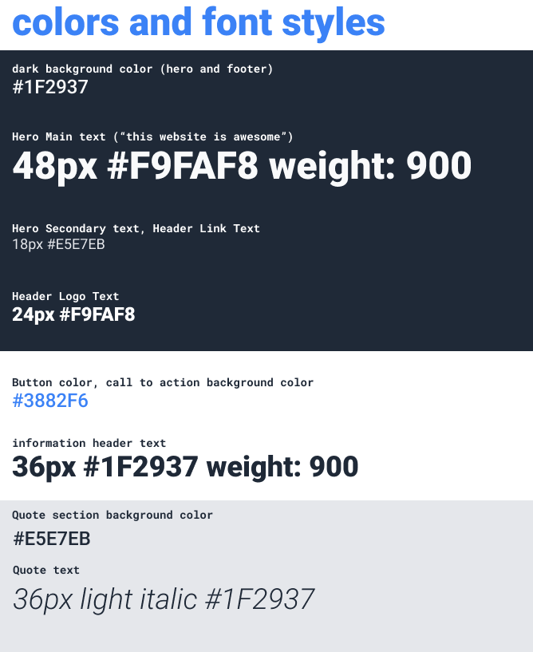
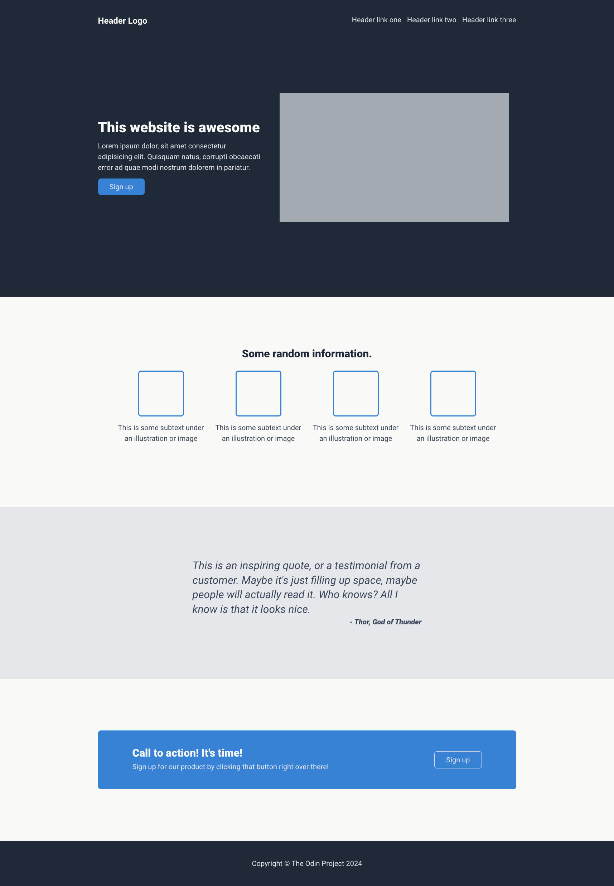
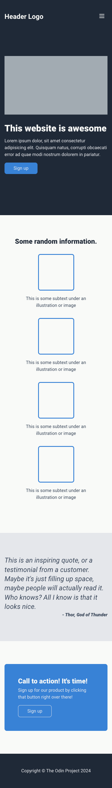

# Odin project - Landing page

This is a solution to the [Landing page - Foundations course project](https://www.theodinproject.com/). The Odin Project empowers aspiring web developers to learn together for free.

## Table of contents

-   [Overview](#overview)
    -   [The challenge](#the-challenge)
    -   [Screenshot](#screenshot)
    -   [Links](#links)
-   [My process](#my-process)
    -   [Built with](#built-with)
-   [Author](#author)

## Overview

### The challenge

#### The design

#### The style guide

### Screenshot

### Links

-   [Repo](https://github.com/darryncodes/odin-landing-page)
-   [Live Site](https://darryncodes.github.io/odin-landing-page/)

## My process

### Built with

-   Semantic HTML5 markup
-   CSS custom properties
-   Flexbox
-   CSS Grid
-   Mobile-first workflow

## Author

-   Twitter - [@darryncodes](https://x.com/darryncodes)
